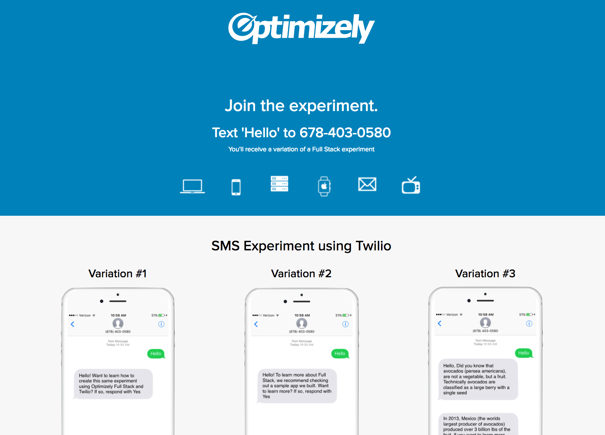

# Optimizely Python Twilio Tutorial
This tutorial enables you to quickly get started in your development efforts to create a Python-based web application that tests the sending of SMS messages using [Twilio](https://www.twilio.com). The Optimizely X Fullstack Outbound Marketing Demo App (Demo App) includes a sample Python application that has been integrated with both Twilio and Optimizely. The Demo App contains a single endpoint (`/sms`) that queries for an Optimizely-powered Experiment Variation, and sends different SMS messages to a phone based on the Variation.

The Demo App runs listens on Port 5000 and includes a static webpage available at `http://localhost:5000/`:



The Demo App works as follows:
* Configuration starts by setting up a Project, Feature, and Event in the Optimizely dashboard, which will be queried by the Demo App using the Optimizely Python API.
* The Demo App consists of a single static webpage stored in **./templates/index.html** and a local server listening on Port 5000 that runs the server.
* The main function and route handlers for the Demo App are defined in **./application.py**.
* The code to create an Optimizely Client instance is defined in **./optimizely_config_manager.py**.
* The Demo App defines a route to handle POST and GET requests to `/sms` that are mapped to a function called `sms`. This function extracts the message and phone number received in the request, queries an Optimizely project to obtain a Variation key, constructs an appropriate SMS text message, and sends that message to the device using the phone number. 
* The `sms` function responds to three different messages received in the request:
  * `hello`: invokes `activate` to query Optimizely for a Variation key and sends varying SMS text content based on the value of the key.
  * `no`: sends an SMS text message indicating that no event tracking has taken place.
  * `yes`: invokes `track()` to track the Experiment and returns an SMS text message thanking the user and pointing them to the GitHub repo.

## Prerequisites
* [Optimizely account](https://app.optimizely.com/signin)
* [Twilio account](https://www.twilio.com/login) with a Twilio phone number that can send and receive SMS texts
* [Python 2.7+](https://www.python.org) including pip
* [Flask](http://flask.pocoo.org)
* A tool such as [cURL](https://curl.haxx.se/) that can invoke REST APIs on the Demo App
* A device that can send and receive SMS text messages

## Quick Start
This section shows you how to prepare the project in the Optimizely portal and run the Demo App as a local server.

### Preparing an Optimizely Project
This section provides the steps to prepare an Optimizely project in your dashboard.

1. Clone or download the **fullstack-outbound-marketing** package.
2. Log in or create an [Optimizely Account](https://app.optimizely.com/signin).
3. Create a project via the Optimizely dashboard.
4. Add an A/B Test with the key (`MySMSABTest`) and three Variation keys: `question`, `suggestion`, and `aggressive`. These will be used by the Demo App to determine the SMS text content to send.
5. Add an Event key called `SMSEvent` and save the event. This event will be triggered when the route handler receives a `yes` message in the request.
6. Navigate to the directory where the package was downloaded to in Step 1 and open **./application.py** in a text editor.
7. Update the following:
 * `<account_sid>`: set to the account SID of your Twilio account.
 * `<auth_token>`: set to the auth token of your Twilio account.
 * `<from_number>`: set to the phone number of the device that is to receive the SMS text message from the application.
 * `<project_id>`: set the ID of the project. This is found in the **Other URL** of the JSON file on the **Settings** page within the Optimizely dashboard (e.g. https://cdn.optimizely.com/json/123456789012.json).
 * `<experiment_key>`: set to `MySMSABTest`.
 * `<track_event>`: set to `SMSEvent`.
8. Save the file. 

### Preparing the Environment
1. Open a Terminal window and navigate to the root of the **fullstack-outbound-marketing** package.
2. Install **Twilio**:
```shell
pip install twilio
```

### Running the Demo App and a Client
1. Run the server:
```shell
python application.py
```
The output should look similar to the following:
```shell
 * Running on http://127.0.0.1:5000/ (Press CTRL+C to quit)
 * Restarting with stat
 * Debugger is active!
 * Debugger pin code: 123-456-803
```
2. (Optional) Open a browser and enter `http://localhost:5000` as the URL. The Demo App's static webpage should display.

3. Open a second Terminal window.
4. Run the following cURL command in the new Terminal window and replace `<your cell number>` with the phone number of the device that is to receive SMS text messages:
```shell
curl -F "Body=hello" -F "From=<your cell number>" -X POST http://localhost:5000/sms
```
The Demo App should send an SMS text via Twilio to the phone number that you specified containing one of the following messages:
* `Hello! Want to learn how to create this same experiment Optimizely Full Stack and Twilio? If so, respond with Yes`
* `'Hello! To learn more about Full Stack, we recommend checking out a sample app we built. Want to learn more? If so, respond with Yes'`
* `Hello, Did you know that avocados (persea americana), are not a vegetable, but a fruit. Technically avocados are classified as a large berry with a single seed. Additionally, in 2013 Mexico (the worlds largest producer of avocados) produced over 3 billion pounds of the fruit. If you want to learn more about this demo, respond with Yes.`

**Note**: The terminal output for the Demo App and the response received on the client (cURL) may include the error: `ValueError: View function did not return a response`. This is because the Demo App's `/sms` does not return a REST response.

5. Respond to the SMS on your device by entering one of the following messages:
* `yes`: The Demo App will send back the following SMS text to your device: `Here's the GitHub repo. We hope you enjoyed this demo and are inspired to build your next app with Optimizely Full Stack. http://bit.ly/2o3CSoK`.
* `no`: The Demo App will send back the following SMS text to your device: `Thank you for your response. No Full Stack conversion event logged. We hope you enjoyed this demo!`.
* Any other value: `Invalid command. Please respond with 'Hello' to start!`.

## How the Demo App was Created
The following subsections provide information about key aspects of the demo and how it was put together:
* [Project Structure](#project-structure)
* [User Interface](#user-interface)
* [Styling](#styling)

### Project Structure
The following are the main components in the package:

1. **./application.py**: contains the main Python code for the Demo App that invokes the Optimizely and Twilio Python APIs.
2. **./optimizely_config_manager.py**: contains a helper class called `OptimizelyConfigManager` that creates the Optimizely client object. Note that **./optimizely_config_manager.py** is the compiled version of this file used by the server.
3. **./assets/images**: contains the art assets displayed on the Demo App's static webpage.
4. **./requirements.txt**: lists the dependencies required for the project.
5. **./templates**: contains the HTML file for the static webpage that is rendered in the browser and mapped to the `/` route exposed by **application.py**.

### User Interface

**Main Page**

The base webpage is defined in **./templates/index.html** and is templated so that it's rendered by the `/` route exposed by **./application.py**:
```python
@application.route('/')
def hello_world():  
  return render_template('index.html')
```

When the application is started, an Optimizely client is created using the `OptimizelyConfigManager` helper class and passing in the ID of the project:
```python
...
PROJECT_ID = 'MyProject'
config_manager = OptimizelyConfigManager(PROJECT_ID)
...
``` 

## Configure Resources
To prepare for API usage:
* [Create the Manager Instance](#create-the-manager-instance)

### Create the Manager Instance
**./optimizely_config_manager.py** defines a helper class called `OptimizelyConfigManager` that creates an instance of the Optimizely client:
```python
...
class OptimizelyConfigManager(object):
  obj = None

  def __init__(self, project_id):
    self.project_id = project_id

  def get_obj(self):
    if not self.obj:
      self.set_obj()
    return self.obj

  def set_obj(self, url=None):
    if not url:
      url = 'https://cdn.optimizely.com/json/{0}.json'.format(self.project_id)

    datafile = self.retrieve_datafile(url)
    self.obj = optimizely.Optimizely(datafile, None, SimpleLogger())

    ...
```

When instantiated, the `__init__` method takes in and stores the ID of the project. When client code retrieves the instance, `get_obj` invokes `set_obj` the first time it's called to create the client. `get_obj`  constructs the URL of the datafile using the project ID, retrieves the datafile using that URL, and creates and stores a reference to an Optimizely client using the data file.

## Functionality
The demo illustrates how to:
* [Check a Variation](#check-a-variation)
* [Track the Experiment](#track-the-experiment)

### Check a Variation
When the client invokes the `/sms` endpoint the `sms` handler for the `/sms` route is invoked:
```python
@application.route('/sms', methods=['GET', 'POST'])
def sms():
  # Twilio data 
  from_number = request.form['From']
  message = request.form['Body'].lower()

  if message == 'hello':
    variation_key = config_manager.get_obj().activate('MySMSABTest', from_number)

    # Check the key for 'question', 'suggestion', or 'aggressive' and send an appropriate SMS text to the device
  ...
```

The handler obtains the phone number and message sent by the client in the REST request. If the client sent the message: `hello`, the handler invokes `activate` passing in the Experiment ID and the phone number to get a Variation. Based on the Variation, the handler then sends an appropriate SMS text to the phone number. 

### Track the Experiment
If the client sent a message containing `yes` then the handler invokes `track`, passing in the ID of the Event defined for the experiment and sends an appropriate SMS text message to the device:
```python
@application.route('/sms', methods=['GET', 'POST'])
def sms():
  ...

  elif message == 'no':
    # send appropriate SMS text to device
    ...

  elif message == 'yes':
    config_manager.get_obj().track('SMSEvent', from_number)
    # send appropriate SMS text to device
    ...

  else:
    # send "invalid command SMS text to device
    ...
```

## Additional Resources
* Developer Docs: [http://developers.optimizely.com/server](http://developers.optimizely.com/server)
* Questions? Shoot us an email at [developers@optimizely.com](mailto:developers@optimizely.com)
